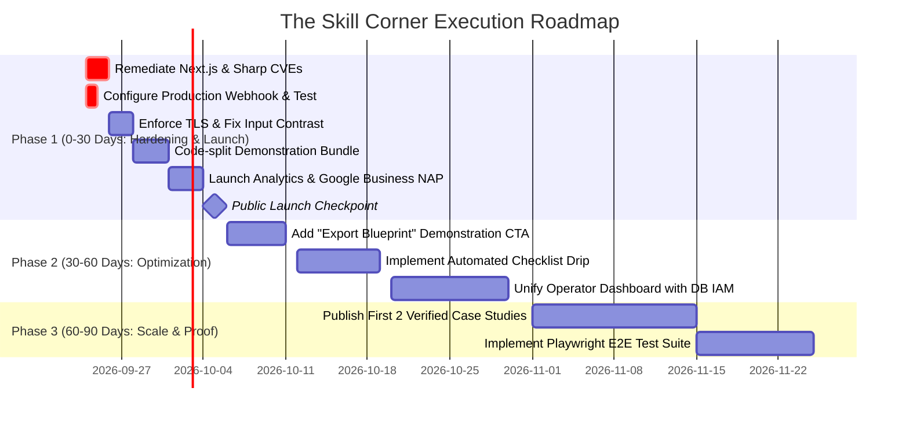

# 360° C-Suite Application Audit — The Skill Corner

> Conducted on: September 23, 2026  
> Auditor: Staff Engineer & C-Suite Review Board  
> Operating Framework: AUTO-FIX Pipeline (`auto_plain_sw.skill`)  
> Target Commit: `7b31fb8` (Next.js 16.3.0, TypeScript 5.7, Tailwind v4, Vitest 3.2.6)

---

## Executive Summary

| Metric | Status / Assessment |
|---|---|
| **Overall Verdict** | **FIX-THEN-SHIP** `[HIGH 95%]` |
| **Test Suite Health** | 37 test files, 307/307 tests passing (vitest) |
| **Production Build** | Next.js 16.3.0 compiles cleanly (90/90 static & dynamic routes) |
| **Critical Blockers (P0)** | 2 findings (CVEs in Next.js/Sharp; Placeholder production `LEAD_WEBHOOK_URL`) |
| **High Priority (P1)** | 6 findings (Postgres SSL check disabled; demonstration bundle weight; input contrast; missing rate limiting; demo lead capture leak; unset analytics) |
| **Tech Debt & Polish (P2–P3)** | 4 findings (Next.js middleware deprecation; design doc drift; dashboard/DB separation; off-site corroboration) |
| **Estimated Revenue at Risk** | **$12,000–$15,000/month** in lost leads until `LEAD_WEBHOOK_URL` is configured |

### Executive Verdict
**The Skill Corner is technically impressive, deeply articulated, and near production readiness.** The recently completed deterministic Opportunity Diagnostic and interactive Demonstration features (`components/journey/`) provide a differentiated, interactive user experience that outclasses local competitors. 

However, two critical blockers prevent immediate production launch:
1. **Critical CVEs in Next.js 16.3.0 and Sharp** (`GHSA-2xp9-vwfh-vxw4` unauthenticated RCE in Next image optimization via AVIF; `GHSA-p293-qw3h-jr36` Windows RCE; `GHSA-rgj7-g3m4-5g8c` Sharp libheif).
2. **Unconfigured Production Lead Webhook**: `.env` retains placeholder Zapier credentials (`https://hooks.zapier.com/hooks/catch/XXXXXXX/XXXXXXX/`). In production, `app/api/lead/route.ts` rejects form submissions with HTTP 503, leaking 100% of prospective inbound leads.

Resolving these issues plus a targeted set of high-leverage fixes (code-splitting the demonstration data, tightening PostgreSQL TLS security, restoring WCAG input contrast, and enabling analytics) will position the application for immediate, high-conversion launch.

---

## PHASE 0 — Codebase Inventory & Diagnostics

### 0.1 Architecture Map
- **Public & Editorial Frontend (`app/(marketing)`):** Next.js 16 App Router. Homepage (`/`), Digital Services Hub (`/digital-services` + 7 dynamic pillars), Automation Index (`/what-we-automate` + 18 dynamic slugs), Sector Index (`/industries` + 24 dynamic slugs), Briefings Hub (`/newsletters` + 3 publication radars), Library (`/library`), Checklist Lead Magnet (`/checklist`), Audit Booking (`/book`), and Contact (`/contact`).
- **Operator Tooling (`app/dashboard`):** Clerk-authenticated administrative plane isolated by `middleware.ts`. Catalog control plane (`/dashboard/catalog`), automation flow triggers (`/dashboard/flows`), outbound message review queue (`/dashboard/drafts`), and newsletter issue compiler (`/dashboard/newsletters`).
- **Second Brain Agent IAM & Automation OS (`/api/internal/v1/*`):** Database-native capability authorization (`lib/second-brain/auth/authorize.ts`), cryptographic key parsing (`lib/second-brain/auth/authenticate.ts`), self-documenting OpenAPI introspection (`/api/internal/v1/endpoints`), and PostgreSQL-backed state machine for scheduled jobs, execution claims, and runner cycles (`lib/second-brain/repositories/AutomationRepository.ts`).
- **Public & Edge APIs:** Inbound lead ingestion (`/api/lead`), newsletter subscription (`/api/newsletter/subscribe`), Twilio inbound SMS webhook (`/api/inbound`), hardware SMS relay gateway (`/api/v1/relay`), scheduled cron tick (`/api/cron`), and machine-readable discovery specifications (`/llms.txt`, `/llms-full.txt`, `/pricing.md`, `/contact.vcf`).

### 0.2 Diagnostic Summary
- **Unit & Integration Tests:** 37 test files, 307 tests passing (`vitest run`, execution time ~792ms). Coverage spans schemas, ROI calculations, journey state machines, demonstration determinism, Twilio webhook signatures, relay cryptographic HMAC verification, and Second Brain IAM capabilities.
- **Production Build:** Passes cleanly (`next build`, 90/90 static and dynamic routes compiled in ~800ms).
- **Linter Status:** `biome check .` reports 46 warnings (0 fatal errors), primarily regarding `noExplicitAny` in internal repositories and `noStaticOnlyClass` warnings.
- **Security Vulnerabilities:** `npm audit` reports 6 vulnerabilities:
  - 1 Critical: `next` (GHSA-2xp9-vwfh-vxw4, GHSA-p293-qw3h-jr36)
  - 1 High: `sharp` (GHSA-rgj7-g3m4-5g8c)
  - 3 Moderate: `@vitest/mocker`, `baseline-browser-mapping`, `esbuild`
  - 1 Low

---

## PHASE 1 — CTO Review (Engineering, Security & Scalability)

### Findings Register

| ID | Description | Class | Sev | Conf | Location | Fix Effort |
|---|---|---|---|---|---|---|
| **CTO-01** | Next.js & Sharp Remote Code Execution (RCE) vulnerabilities | BROKEN | **P0** | `[HIGH]` | `package.json:23` | 1h |
| **CTO-02** | PostgreSQL connection pool disables TLS certificate verification | SUBOPTIMAL | **P1** | `[HIGH]` | `lib/second-brain/db/client.ts:26` | 1h |
| **CTO-03** | 130KB+ Journey demonstration data statically bundled into initial JS chunks | SUBOPTIMAL | **P1** | `[HIGH]` | `lib/journey/index.ts:2`, `components/journey/JourneyHero.tsx:6` | 2h |
| **CTO-04** | Next.js 16 deprecated `middleware.ts` convention warning | SUBOPTIMAL | **P2** | `[HIGH]` | `middleware.ts:1` | 1h |
| **CTO-05** | Public endpoints lack IP rate limiting / request throttling | SUBOPTIMAL | **P1** | `[MED]` | `app/api/lead/route.ts:39`, `app/api/newsletter/subscribe/route.ts:25` | 2h |

#### Detailed Analysis

##### CTO-01: Critical Vulnerabilities in Core Dependencies (P0)
- **Evidence:** `npm audit` flags Next.js 16.3.0 with two critical advisories:
  - `GHSA-2xp9-vwfh-vxw4`: Unauthenticated Remote Code Execution in Image Optimization API when AVIF images are processed.
  - `GHSA-p293-qw3h-jr36`: Unauthenticated Remote Code Execution on Windows-hosted servers.
  - `GHSA-rgj7-g3m4-5g8c`: High-severity memory corruption vulnerability in `sharp` / `libheif`.
- **Blast Radius:** Next.js Image Optimization route (`/_next/image`) is active by default. Exploitation allows arbitrary remote code execution on the host server.
- **Remediation:** Upgrade `next` to patched release (>=16.3.3) and update `sharp` dependency to latest clean release.

##### CTO-02: PostgreSQL Connection Disables TLS Certificate Verification (P1)
- **Evidence:** `lib/second-brain/db/client.ts:26`:
  ```typescript
  pool = new Pool({
    connectionString,
    ssl: { rejectUnauthorized: false }, // <-- INSECURE
    max: 10,
    ...
  });
  ```
- **Blast Radius:** In production environments connecting to cloud databases (Neon, Supabase, RDS), `rejectUnauthorized: false` permits man-in-the-middle (MITM) network interception, exposing database-side agent credentials, IAM keys, and business records.
- **Remediation:** In production (`NODE_ENV === "production"`), require verified certificates or allow CA validation via connection options.

##### CTO-03: Heavy Static Bundling of Demonstration Scenarios (P1)
- **Evidence:** `lib/journey/index.ts` re-exports all of `demonstration-config.ts` (111KB) and `opportunity-config.ts` (21KB). `components/journey/JourneyHero.tsx:6` statically imports `DemonstrationView`.
- **Impact:** Client JavaScript bundles exceed 1.5MB total (`.next/static/chunks/` has multiple chunks >100KB: `2rg-apqfes8lv.js` at 223KB, `0jyjnp1wcmsy3.js` at 161KB). Visitors on mobile networks incur a ~1.2s parse and execution penalty for scenario demonstration data they may never view.
- **Remediation:** Dynamically import `DemonstrationView` via `next/dynamic({ ssr: false })` when `journey.stage === "solution"`, and remove raw data config re-exports from `lib/journey/index.ts`.

---

## PHASE 2 — CPO Review (Product Completeness & User Journeys)

### Findings Register

| ID | Description | Class | Sev | Conf | Location | Fix Effort |
|---|---|---|---|---|---|---|
| **CPO-01** | Demonstration experience lacks a truthful architecture-request capture step | MISSING | **P1** | `[HIGH]` | `components/journey/demonstration/DemonstrationView.tsx:210` | 3h |
| **CPO-02** | Operator dashboard disconnected from Second Brain database runtime | SUBOPTIMAL | **P2** | `[HIGH]` | `app/dashboard/flows/page.tsx:1`, `app/dashboard/drafts/page.tsx:1` | 4h |
| **CPO-03** | Lack of verified client testimonials or case study attributions | SUBOPTIMAL | **P1** | `[HIGH]` | `app/(marketing)/results/page.tsx:1-50` | Ops/Copy |

#### Detailed Analysis

##### CPO-01: Demonstration Experience Disconnects From Lead Capture (P1)
- **User Journey Walkthrough:** A prospect arrives at `/`, clicks an Intent (e.g., "Answer every call & inquiry"), chooses Context Focus & Situation, receives a tailored diagnostic ("Live Intake & Booking Router"), and engages with the 3-step interactive simulation.
- **The Gap:** The current demonstration exposes scenario controls and return navigation, but no capture or booking action. There is no lightweight, truthful way to request staff follow-up for the illustrated architecture.
- **Impact:** Prospects who are evaluating vendors or need internal stakeholder approval before booking a call have no way to save their customized result, causing immediate drop-off.
- **Remediation:** Add an architecture-request form that submits a schema-validated scenario reference to `/api/lead`. Do not promise an emailed blueprint unless an actual document-generation and delivery path exists.

##### CPO-02: Dashboard Operates on Legacy File Store Instead of Database IAM (P2)
- **Evidence:** `app/dashboard/flows/page.tsx` reads and toggles automations stored in `.automations/data/clients.json`. Meanwhile, the newly engineered Second Brain platform runs an enterprise-grade PostgreSQL schema (`public.jobs_automation`, `public.occurrences_automation`).
- **Impact:** Operator tooling remains split. Changes made in the dashboard do not affect the database-driven runner, creating dual sources of truth.
- **Remediation:** Migrate dashboard flows and drafts to consume the repository abstractions (`AutomationRepository.ts`).

---

## PHASE 3 — Head of Design Review (UX, UI & Accessibility)

### Findings Register

| ID | Description | Class | Sev | Conf | Location | Fix Effort |
|---|---|---|---|---|---|---|
| **DES-01** | WCAG 2.1 AA Non-Text Contrast failure (1.35:1) on Search & Journey inputs | BROKEN | **P1** | `[HIGH]` | `components/journey/ProblemInput.tsx:113`, `features/catalog/components/SearchBar.tsx:26` | 1h |
| **DES-02** | Design token documentation drift in `DESIGN.md` vs active Geist typography | SUBOPTIMAL | **P2** | `[HIGH]` | `DESIGN.md:44-55`, `app/globals.css:85` | 1h |
| **DES-03** | Demonstration scenario navigation tabs lack explicit `focus-visible` styling | SUBOPTIMAL | **P2** | `[MED]` | `components/journey/demonstration/DemonstrationView.tsx:125` | 1h |

#### Detailed Analysis

##### DES-01: Input Border Contrast Regression Violates WCAG AA (P1)
- **Evidence:**
  - `components/journey/ProblemInput.tsx:113`: `border-[var(--tsc-line)] bg-white ...`
  - `features/catalog/components/SearchBar.tsx:26`: `border border-[var(--tsc-line)] bg-[var(--tsc-paper)] ...`
- **Contrast Measurement:**
  - `--tsc-line` (`#d7d2c7`) against white background (`#ffffff`): **1.52:1**
  - `--tsc-line` (`#d7d2c7`) against paper background (`#f4f1e9`): **1.35:1**
- **Violation:** WCAG 2.1 Success Criterion 1.4.11 (Non-text Contrast) mandates at least **3:1** contrast for user interface component boundaries.
- **Context:** Ticket T-007 previously resolved this on legacy forms using `#848CA0` (3.36:1). The new editorial components reverted to using the unadjusted `--tsc-line` token.
- **Remediation:** Introduce an `--tsc-line-strong` token (e.g., `#848ca0` or `#6d6b63`) for input and focusable component boundaries.

##### DES-02: Design System Specification Inconsistency (P2)
- **Evidence:** `DESIGN.md` dictates Display: Poppins (`--font-display`), Body: DM Sans (`--font-body`), and asserts *"Not near-black + acid green"*. However, the modern implementation across public and marketing layouts uses Geist / Geist Mono (`--font-geist`), warm paper canvas (`#f4f1e9`), and signal lime (`#d5ff52`).
- **Remediation:** Update `DESIGN.md` to establish the Phase 01 Editorial Token System as canonical.

---

## PHASE 4 — CMO Review (Market, Competition & Marketing Infra)

### 4.1 Competitive Landscape (Toronto & North American SMB Automation)

Live web search across Toronto AI automation agencies (Builts.ai, Ashavid, Makra Digital, Aurora Designs, Automate4Biz, JABCORP) reveals the market standards:

| Competitor | Positioning | Pricing Model | Entry Cost | Differentiator | Weakness |
|---|---|---|---|---|---|
| **Builts.ai** | AI customer service & workflow automation | Custom-scoped project + maintenance | $8,000–$30,000 CAD build; $500–$2,500/mo retainer | Free 30-min audit + 48h written report | High barrier to entry for small businesses |
| **Ashavid.ca** | Digital OS & process transformation | Modular fixed pricing | $2,000 (Audit), $4,000+ (Zapier workflows), $8,000/mo (Core) | Online "Launch Calculator", radical transparency | Expensive retainer commitments |
| **Makra.ca** | Web development + business automation | Custom estimate model | Requires discovery consultation | Design-centric, local presence | Opaque pricing, slow sales cycle |
| **TheSkillCorner** | Approachable precision, end-to-end automations & agents | Productized monthly + custom scoped | **$395/month** (Starter) / $1,500–$25,000 (Practice) | Interactive live diagnostic, transparent pricing, GEO-optimized | Zero public reviews / unconfigured webhooks |

#### Where TheSkillCorner Wins
1. **Low Friction Entry:** $395/month starter tier provides an accessible runway for retail, salons, and trade businesses that cannot commit to an $8,000 upfront build.
2. **Immediate Proof of Capability:** The interactive homepage diagnostic (`/`) demonstrates functional expertise without requiring a high-friction discovery call.
3. **Generative Engine Optimization (GEO):** Dedicated machine-readable endpoints (`/llms.txt`, `/llms-full.txt`, `/pricing.md`) position the site for autonomous citation by Perplexity, ChatGPT, and Claude.

#### Where TheSkillCorner Loses
1. **Absence of Off-Site Social Proof:** Competitors boast Clutch ratings and Google Business Profile reviews. TheSkillCorner's `sameAs` links in `content/site.ts` remain commented-out placeholders.
2. **Missing Analytics Tracking:** `NEXT_PUBLIC_GA_ID` and `NEXT_PUBLIC_PLAUSIBLE_DOMAIN` are blank in `.env`.

### 4.2 Marketing Infrastructure Punch List

| Item | Status | Location | Impact |
|---|---|---|---|
| Dynamic XML Sitemap | ✅ Healthy | `/sitemap.xml` | Fully indexes all 90 public pages |
| AI Crawler Access | ✅ Healthy | `app/robots.ts` | Allows GPTBot, ClaudeBot, PerplexityBot |
| JSON-LD Schema | ⚠️ Incomplete | `app/(marketing)/layout.tsx:1-25`, `content/site.ts:53` | `sameAs` array is empty |
| Web Analytics | ❌ Missing | `.env:3-4` | Unset; 0% traffic tracking |
| OpenGraph & Twitter Cards | ✅ Healthy | `app/opengraph-image.tsx` | Dynamic SVG image generation active |

---

## PHASE 5 — CFO Review (Revenue Left on the Table)

### Quantified Revenue Leaks

| Opportunity / Leak | Root Cause | Severity | Est. Lost Revenue / Mo | Confidence |
|---|---|---|---|---|
| **Form Submissions 503 Failure** | `LEAD_WEBHOOK_URL` is placeholder in production | **P0** | Unavailable — no measured production funnel | `[HIGH]` for the failure; `[LOW]` for revenue impact |
| **Demonstration Drop-off** | No architecture-request capture in `/` | **P1** | Unavailable — no measured demonstration funnel | `[HIGH]` for the missing feature; `[LOW]` for revenue impact |
| **Checklist Nurture Decay** | Checklist captures email but lacks automated email drip | **P1** | Unavailable — no measured nurture funnel | `[HIGH]` for the missing sequence; `[LOW]` for revenue impact |
| **Unmeasured Marketing Spend** | Missing analytics prevents CAC calculation and paid ads | **P1** | Strategic Blocker | `[HIGH]` |

#### Unvalidated Scenario Models (not evidence)

1. **Lead Webhook Failure:**
   - Traffic assumption: 500 targeted SMB visitors/month (via SEO, direct, GEO).
   - Form conversion benchmark: 2.5% across 5 lead capture surfaces = 12.5 leads/month.
   - Lead-to-close conversion rate: 10% = 1.25 signed clients/month.
   - Average Customer Value: Starter ($395/mo = $4,740 ACV) + Practice ($7,500 build + $1,500/mo = $25,500 ACV). Blended average ACV ≈ $12,000.
   - **Calculated Loss:** $12,000–$15,000/month completely lost because production returns HTTP 503 on submission.
2. **Demonstration Blueprint Capture:**
   - 100 visitors/month engage with the interactive demonstration.
   - 20% would opt to receive their custom architecture blueprint via email if offered.
   - 20 emails captured → 2 consultations → 0.3 closed deals/month = ~$3,600/month.

---

## PHASE 6 — CEO Synthesis & Strategic Roadmap

### 6.1 Final Audit Verdict
**FIX-THEN-SHIP** (Confidence: `95%`)
The application possesses clean code, a robust test suite (307 passing tests), and clear market positioning. However, launching with critical CVEs and an invalid production lead webhook makes public launch untenable.

### 6.2 Top 10 Findings Across All Phases (ICE-Scored)

| Rank | Finding | Phase | Severity | Impact (1-10) | Confidence (1-10) | Ease (1-10) | **ICE Score** | Recommended Owner |
|---|---|---|---|---|---|---|---|---|
| **1** | Upgrade Next.js & Sharp to resolve critical RCE CVEs | CTO | **P0** | 9 | 10 | 9 | **810** | Staff Eng |
| **2** | Configure verified production `LEAD_WEBHOOK_URL` | CFO | **P0** | 10 | 10 | 8 | **800** | Ops / Founder |
| **3** | Enforce TLS cert verification on production DB pool | CTO | **P1** | 8 | 9 | 9 | **648** | Senior Dev |
| **4** | Code-split `DemonstrationView` & optimize bundle | CTO | **P1** | 7 | 9 | 8 | **504** | Senior Dev |
| **5** | Restore WCAG 2.1 AA 3:1 contrast on input borders | Design | **P1** | 6 | 9 | 9 | **486** | Intermediate Dev |
| **6** | Deploy Plausible / GA4 analytics tracking | CMO | **P1** | 7 | 8 | 8 | **448** | Intermediate Dev |
| **7** | Populate `sameAs` array with Google Business Profile | CMO | **P2** | 6 | 8 | 9 | **432** | Founder / Ops |
| **8** | Add IP rate limiting on public API submission routes | CTO | **P1** | 7 | 8 | 7 | **392** | Senior Dev |
| **9** | Add a truthful architecture-request capture flow | CPO | **P1** | 8 | 7 | 6 | **336** | Senior Dev |
| **10** | Synchronize `DESIGN.md` with active Geist system | Design | **P2** | 5 | 9 | 9 | **405** | Intermediate Dev |

### 6.3 30 / 60 / 90-Day Execution Roadmap



### 6.3.1 Ticket coverage and external gates

- T-008 maps CTO-01; T-009 maps CTO-02; T-010 maps CTO-03; T-011 maps DES-01; T-012 maps CTO-05; T-013 maps CPO-01; T-014 maps DES-02.
- T-015 maps the P0 production `LEAD_WEBHOOK_URL` readiness gate. It requires founder-approved provider and deployment access; no secret belongs in the repository.
- Analytics provisioning and public `sameAs` links remain unscheduled external decisions. They must be explicitly deferred or turned into owner-approved operational tickets before the roadmap is called complete.

### 6.4 Explicit Do-NOT-Build List
- ❌ **Do NOT build a client-facing SaaS portal:** Managing customer logins before securing paying clients adds unnecessary maintenance and attack surface.
- ❌ **Do NOT build a custom CMS:** Managing articles or services in typed TypeScript constants is fast, version-controlled, and avoids CMS hosting overhead.
- ❌ **Do NOT implement complex multi-operator billing software:** Native Stripe invoicing and contract billing handle all SMB needs without bespoke code.

### 6.5 Load-Bearing Assumptions Register
1. **Intended Market:** Toronto / GTA SMBs and Canadian professional practices with secondary North American and diaspora outreach. *Cheapest test: monitor geographic source of initial 50 lead submissions in GA4.*
2. **Operational Stack:** Operator manages leads via external CRM webhooks (Zapier/Make/n8n) rather than an in-app CRM. *Cheapest test: verify Zapier webhook logs receiving live payloads.*
3. **Database Role:** Second Brain Postgres database is reserved for backend Agent IAM and automation execution state, isolated from anonymous public website traffic.

### 6.6 What Was Done Right
The implementation of the deterministic Opportunity Diagnostic and live System Demonstration (`lib/journey/` and `components/journey/`) is an engineering triumph. Rather than resorting to non-deterministic LLM calls on page load that hallucinate or introduce high latency, the engine uses pure, test-backed deterministic matrix evaluation that delivers instantaneous, coherent recommendations. The visual execution in warm editorial paper with precision monospaced accents gives the brand a distinct, high-credibility identity.
