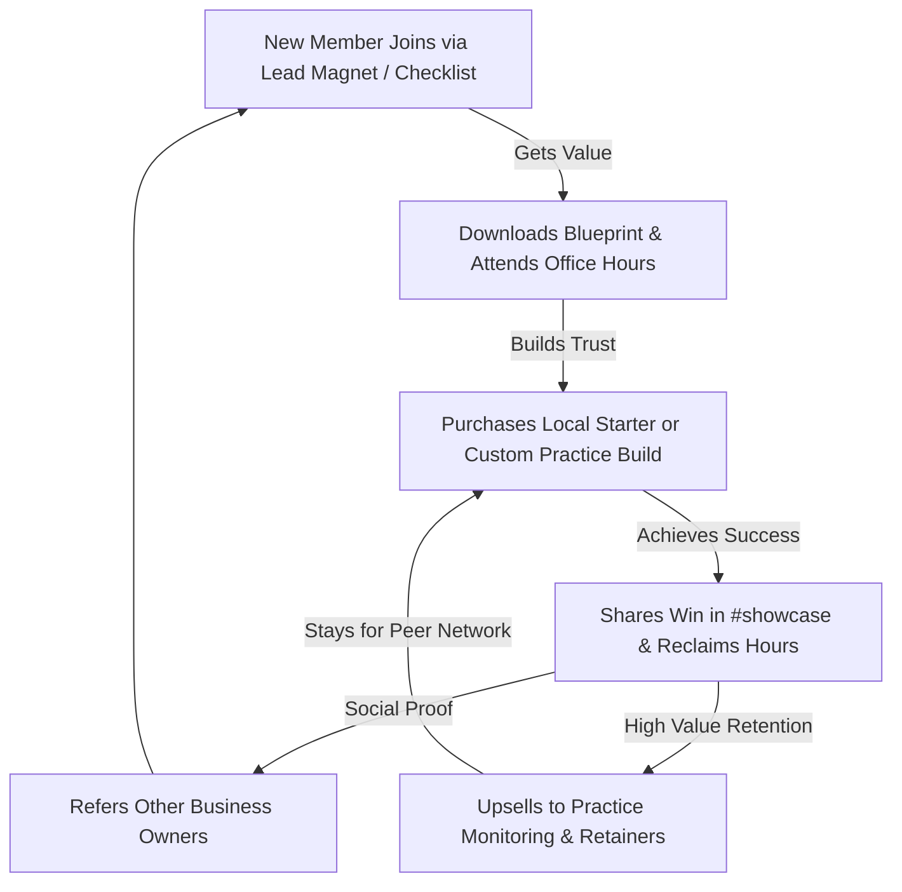

# Community Strategy: "The Leveraged Operator"
**Designed for:** The Skill Corner (Toronto, ON)
**Date:** June 12, 2026
**Objective:** Create a high-value community that drives retention, reduces churn on retainers, and serves as a word-of-mouth engine to attract local businesses and professional practices.

---

## 1. Context & Strategic Alignment

Based on The Skill Corner's market research and business positioning:
* **The Segments:**
  1. *Local Starter Segment:* Salons, gyms, contractors, retail (paying $395/month, cancelled monthly). High churn risk (average lifetime ~11 months), very sensitive to clear ROI.
  2. *Professional Practices Segment:* Medical, dental, law, accounting, real estate (paying $7.5K–$25K build + $1,500–$2,500/month retainers). High trust requirement, strict PIPEDA/PHIPA compliance needs, low tech-savviness but high willingness to pay for "Done-For-You."
* **Primary Community Goal:** 
  1. **Retention & Churn Reduction:** Educate local business owners on how to compound their automation gains so they don't cancel after the first 6–12 months.
  2. **Word-of-Mouth Lead Generation:** Enable members to showcase their systems, driving referral loops.
  3. **High-Ticket Trust Building:** Give professional practices an educational environment to see real-world automations and compliance frameworks before booking an audit.

---

## 2. Shared Identity & Value Proposition

Communities built around a product fail; communities built around a shared identity succeed.

### The Shared Identity: **The Leveraged Operator**
Members of this community do not identify as "AI hobbyists." They are local business owners, practice managers, and partners who view manual labor as a systems failure. Their badge of honor is *leverage*—doing more with fewer keystrokes, reclaiming their weekends, and scaling without linear hiring.

### Member-First Value Flow
To keep busy business owners engaged, every interaction must offer immediate, practical value:
1. **Automation Blueprints:** Click-and-copy workflows (e.g., Zapier/Make templates, prompt sheets, system design diagrams) for common tasks (e.g., Google Review SMS triggers, Intake-to-CRM routing).
2. **B2B Peer Intelligence:** Unbiased reviews of vertical software (e.g., Jane App vs. Mindbody) and how they integrate.
3. **The Compliance Safe-Haven:** Clear, plain-English advice on how to handle privacy laws (PIPEDA/PHIPA) when introducing automation.
4. **Expert Office Hours:** Bi-weekly micro-clinics where The Skill Corner engineering team troubleshoots members' broken workflows for free.

---

## 3. Platform Selection: Circle vs. Slack

Given the target segments, we recommend a hybrid approach with **Circle** as the primary hub:

| Feature | Circle (Recommended) | Slack |
| :--- | :--- | :--- |
| **Best For** | Structured resources, searchable Q&A, courses, clean UX. | Real-time chat, immediate notifications, B2B workspaces. |
| **Pros** | Organizes content into distinct spaces (e.g., "Blueprints", "Q&A"); content does not disappear; indexable by search engines (optional for SEO benefits); cleaner UI that does not feel like "work." | Extremely familiar to professional services (lawyers, accountants). Real-time engagement is easier to spark initially. |
| **Cons** | Requires driving traffic; user has to open a separate tab/app. | Free tier limits message history; high noise; feels like another work channel; content is hard to search or save. |
| **Verdict** | **Winner.** Professional practices (physios, dentists, partners) want a clean portal where they can read a guide at 8:00 PM without being bombarded by chat messages. Local owners can dip in weekly. | **Backup.** Only use if you plan to target highly tech-literate service providers who are already active on Slack all day. |

---

## 4. The Community Flywheel

To drive business growth, the community must feed back into the agency's bottom line:

---

## 5. The 90-Day Launch Plan (From 0 to 100 Members)

### Phase 1: The Founding 30 (Days 1–30)
* **Goal:** Recruit 20–30 highly relevant founding members manually. Do not launch publicly.
* **Target Profile:** Current clients, past leads, and warm local business owners in Toronto.
* **The Ask (1:1 outreach):** *"Hey [Name], we’re launching a private, closed community for Toronto business owners who are automating their operations. We’re seeding it with 5 done-for-you templates. I'd love to invite you as a founding member—no cost, but I’d value your feedback on the templates."*
* **Seeding Content:** Pre-populate the community with 5–8 high-value posts before inviting anyone:
  1. *Blueprint:* How to auto-text back missed calls in under 10 minutes.
  2. *Guide:* PHIPA & PIPEDA Checklist for Canadian clinics using AI.
  3. *Case Study:* How a local physiotherapy clinic cut no-shows by 40% using automated SMS sequences.
  4. *Discussion:* What is the single biggest bottleneck in your office workflow today?

### Phase 2: Building Rituals & Habits (Days 31–60)
* **Goal:** Establish a weekly operational cadence to convert passive lurkers into active participants.
* **Weekly Cadence:**
  * **Tuesday: Audit Day.** Post a workflow submitted by a member and show a video recording of how to optimize/automate it.
  * **Thursday: Tech Spotlight.** Review a tool (e.g., "Why we prefer Cal.com over Calendly for HIPAA compliance").
  * **Friday: Wins & Showcases.** Prompt members to share their wins: *"What manual task did you banish this week? How many hours did you get back?"*
* **High-Touch Support:** The Community Manager must reply to every post within 4 hours. Tag relevant members to spark conversation: *"Hey @DrJane, this reminds me of how you resolved your dental intake problem—any thoughts?"*

### Phase 3: Opening the Gates (Days 61–90)
* **Goal:** Turn the community into a customer acquisition engine.
* **Integration with Site Lead Gen:**
  * Link to the community directly from `/checklist` success page and in the automated checklist email.
  * Offer a "Free Automation Audit Review" inside the community: users post their workflow, and we audit it publicly.
* **First Live Event:** Host a 45-minute virtual workshop: *"The 3 Automations Toronto Clinics Must Run in 2026."* Promote to the email list and local LinkedIn groups.

---

## 6. Channel Architecture (Circle Spaces)

We recommend dividing the community into three core categories:

### Category A: The Library (Read-Only / High Value)
* **#welcome-rules:** A pinned message detailing the culture, code of conduct, and how to introduce yourself.
* **#automation-blueprints:** Actionable guides, Zap templates, and step-by-step videos. Every post must include a clear "Hours Saved per Week" estimation.
* **#compliance-corner:** Specific templates and guides for Canadian privacy standards (PIPEDA/PHIPA/FIPPA).

### Category B: The Circle (Interactive)
* **#introductions:** A space for new members to share their business type, location, and main workflow bottleneck.
* **#ask-an-expert:** Q&A channel where members ask technical questions about automations. The Skill Corner engineers provide expert answers.
* **#workflow-showcase:** Members post screenshots or descriptions of their automated flows. The community celebrates and offers critiques.
* **#general-chat:** Networking and general discussion about running a business in the GTA.

### Category C: Events (Structured)
* **#live-workshops:** RSVP links and calendar events for the monthly workshops and bi-weekly office hours.

---

## 7. Operational Playbook & Rituals

### Daily Checklist for Community Lead (1.5 hours/week)
* **Morning Check (10 mins):** Check all channels. Answer unanswered questions or route them to technical staff.
* **Welcome Routine (10 mins):** Direct-message new signups. Ask: *"What is the main task you'd like to get off your plate this week?"* Tag them in `#introductions`.
* **Weekly Post Execution (20 mins):** Write and schedule the weekly ritual posts.

### Ambassador/Advocate Program: "The Corner Club"
To accelerate word-of-mouth growth once the community reaches 50 members, launch an invite-only advocate program for top clients and power users.
* **Selection Criteria:** Members who have achieved measurable ROI using The Skill Corner, recommend the agency unprompted, or answer peer questions in the community.
* **Member Benefits:**
  * A private, secret Circle space for direct roadmap access.
  * Custom local swag ("Powered by The Skill Corner" coffee mugs for their office).
  * 15% recurring referral commission for any client they refer who signs up for a retainer.
  * Annual "Ambassador Dinner" in Toronto with the founding team.

---

## 8. Health Metrics & Warning Signs

Track these metrics weekly to measure health and retention:

| Metric | Target | Why It Matters |
| :--- | :--- | :--- |
| **Weekly Active Members (WAM / total)** | >30% | Indicates stickiness. Are members returning or registering and forgetting? |
| **New Member Post Rate (7 days)** | >40% | Measures immediate activation. Did they post an intro or comment within a week of joining? |
| **Thread Reply Rate** | 100% | No post should go unanswered for >24 hours. The agency must guarantee a response. |
| **Client Churn Indicator** | <5% lurker overlap | Monitor if active retainer clients stop logging in for 30+ days; this is a leading indicator of contract cancellation. |

### Warning Signs & Immediate Fixes
* **Symptom:** Only The Skill Corner team is posting.
  * *Fix:* Move to a 1:1 outreach strategy. Reach out to three members in DMs, ask for their feedback on a specific problem, and ask: *"Can you post that question in the Q&A channel? I want to write a detailed guide answering it for everyone."*
* **Symptom:** Members join but do not post introductions.
  * *Fix:* Simplify the onboarding journey. Add an automated prompt in Circle that asks a single, low-friction question: *"What is the one software tool you couldn't run your business without?"*
