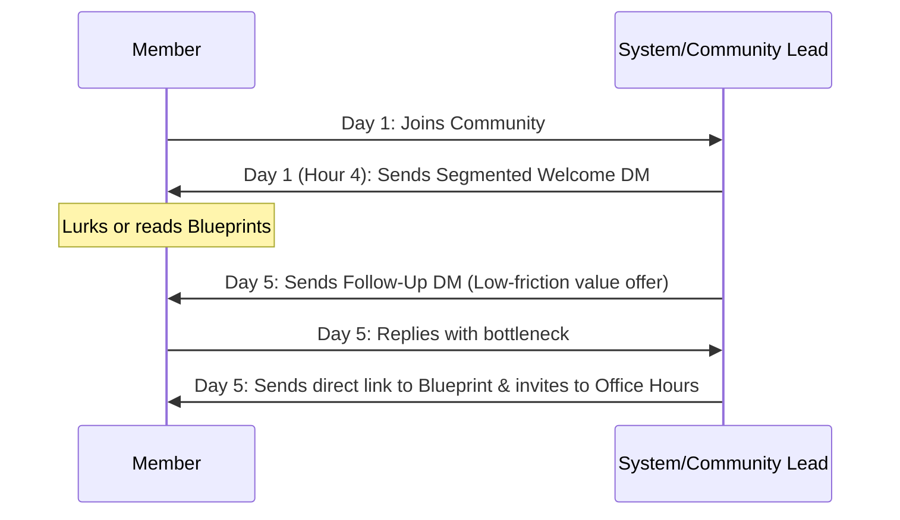

# New Member Journey & Onboarding Playbook
**Brand:** The Skill Corner
**Target Audience:** "The Leveraged Operator" (Local Business Owners & Professional Practice Managers)

First impressions dictate long-term engagement. When a busy owner or practice manager joins our community, they should instantly feel that their time is respected, that high-value utility is immediately accessible, and that they are in a room of peers.

---

## 1. Pinned Welcome Post (`#welcome-rules`)

This post is pinned in the entry channel and locked to read-only. It outlines the community purpose and gives a clear "Start Here" path.

```markdown
# Welcome to The Leveraged Operator! 🚀

If you are a local business owner or professional practice partner in the Greater Toronto Area (or beyond), you are in the right place. 

We built this community for one reason: **to help you reclaim hours lost to manual tasks by sharing real-world business automation blueprints.**

Here is how to make the most of your first 15 minutes:

### 1️⃣ Start Here
Head over to [#introductions](file:///opt/Developer/SourceCode/Projects/TheSkillCorner/docs/community/new-member-journey.md#introductions) and tell us:
* What your business does and where you are located.
* The single most annoying manual task (bookings, reviews, phone tags, intake forms) you or your staff do by hand every week.

### 2️⃣ Claim Your First Win
Go to [#automation-blueprints](file:///opt/Developer/SourceCode/Projects/TheSkillCorner/docs/community/new-member-journey.md#automation-blueprints) and download a click-and-copy workflow. 
* *Recommendation:* Download our "Missed-Call SMS Auto-Text" blueprint. It takes 10 minutes to configure and saves an average of 4 hours/week of phone tag.

### 3️⃣ Ask for Help
Stuck on a workflow or trying to make two apps talk? Post details in [#ask-an-expert](file:///opt/Developer/SourceCode/Projects/TheSkillCorner/docs/community/new-member-journey.md#ask-an-expert). Our engineering team answers technical automation questions for free.

---

### 🚨 The Rules of the Room
* **No Blind Pitches:** Do not drop generic sales links. If you are sharing a tool or service, explain *how* you use it in your business and the exact metrics it improved.
* **Keep Patient/Client Data Secure:** Do not share any personally identifiable information (PII), patient health information (PHI), or confidential client files. Use dummy text or blurred screenshots when sharing workflows.
* **Be Specific:** Help others by detailing the tools, costs, and software versions you use.
```

---

## 2. Pinned Post Template: `#introductions`

The pinned post in `#introductions` should model a perfect introduction to reduce friction and show members what information is helpful.

```markdown
# Introduce Yourself! 👋

Welcome! Don't let writer's block stop you. Copy and paste this template to introduce yourself:

***

* **Who I am:** [Name] & [Your Role]
* **My Business:** [Business Name] (e.g., Medical Clinic, Trade Service, Boutique Retail)
* **Our Location:** [City/Neighborhood]
* **Our Tech Stack:** [Booking software, CRM, or email tools you use, e.g., Jane App, Mailchimp, GSuite]
* **Workflow bottleneck we want to banish:** [What is the #1 manual task you want automated?]
```

---

## 3. Direct Message (DM) Onboarding Sequence

An automated or manual welcome DM should land within 4 hours of a new member joining. This initiates a 1:1 conversation, building trust and opening a direct line to sales/audits.

### Option A: Local Business Segment Welcomer
*For owners of salons, gyms, retail, or home-trade services.*

> **Subject:** Welcome to the community, [First Name]!
>
> Hey [First Name],
>
> Thanks for joining! I saw you run **[Business Name]** in **[City]**. 
>
> I want to make sure you get immediate value here. What's the one manual workflow in your business that currently drains the most time for you or your team? (For most local owners, it's either chasing missed calls, chasing review requests, or manual reminder texts).
>
> If you tell me what you're dealing with, I can point you directly to the exact blueprint we have for it.
>
> Welcome aboard,
> [Founder Name]
> Founder, The Skill Corner

### Option B: Professional Practice Segment Welcomer
*For partners or practice managers at clinics, law firms, veterinary hospitals, or accounting firms.*

> **Subject:** Welcome to the community, [First Name]!
>
> Hi [First Name],
>
> Welcome to The Leveraged Operator! I noticed you are with **[Practice Name]**.
>
> Many clinical and professional practices join us to solve scheduling leaks and intake bottlenecks while maintaining compliance. 
>
> I highly recommend checking out our **#compliance-corner** space for our plain-English guide on PIPEDA/PHIPA-aware automation setups.
>
> Are there specific clinical intake or scheduling bottlenecks you're looking to automate right now?
>
> Best regards,
> [Founder Name]
> Founder, The Skill Corner

---

## 4. First-Week Prompts & Engagement Sequence

If a new member hasn't posted an introduction or engaged within 5 days, trigger this gentle follow-up sequence:



### Day 5 Follow-Up DM (Only if no introduction has been posted)
> Hey [First Name], 
>
> I know how busy running a business gets! Just wanted to share our latest blueprint: **"The Auto-Review Loop"**—it shows how to hook your booking software directly to Google Reviews to auto-request stars from happy clients.
> 
> You can find it pinned in **#automation-blueprints**. Let me know if you run into any trouble setting it up!
