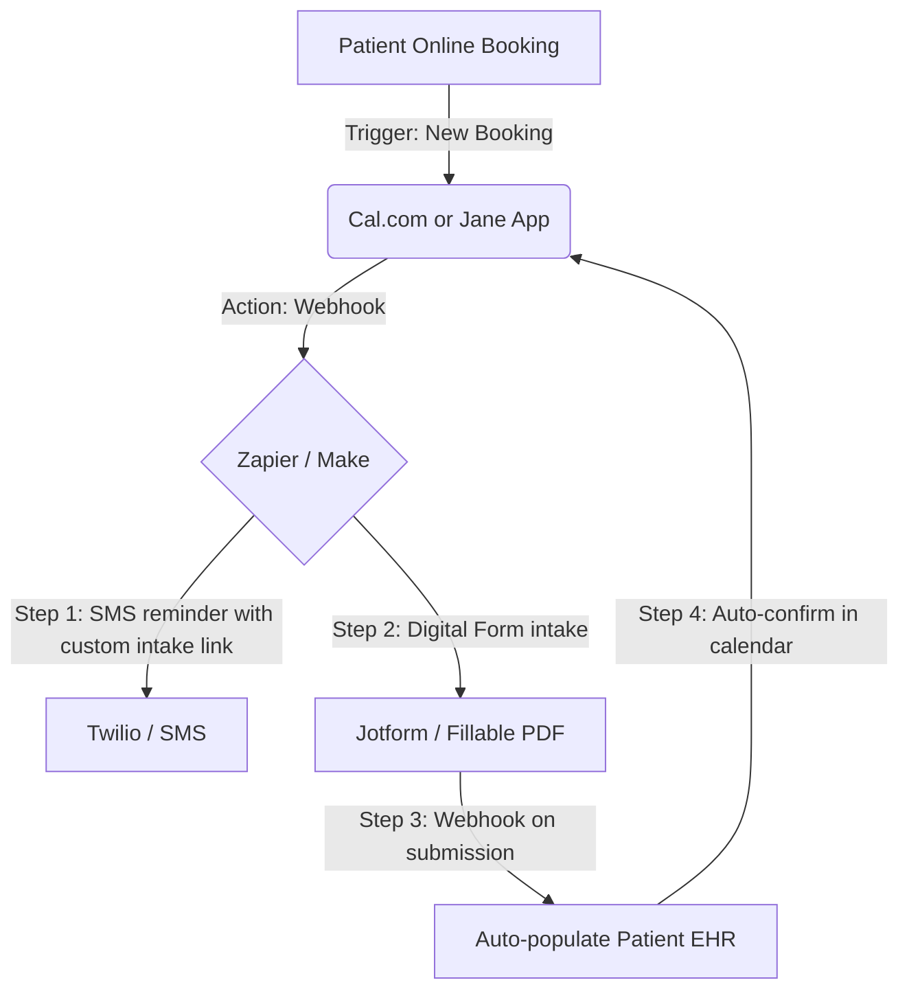

# Community Ritual Calendar & Content Playbook
**Brand:** The Skill Corner
**Target Audience:** "The Leveraged Operator" (Local Business Owners & Professional Practice Managers)

Rituals create habits. To keep busy business owners returning to the community without overwhelming them with chat noise, we establish a predictable weekly cadence and high-value monthly virtual events.

---

## 1. Weekly Ritual Overview

| Day | Ritual Name | Focus | Goal |
| :--- | :--- | :--- | :--- |
| **Tuesday** | Workflow Audit | Auditing a common business bottleneck. | Education & trust building. |
| **Thursday** | Tech Spotlight | Unbiased reviews of automation tools and software. | Providing peer intelligence. |
| **Friday** | Friday Wins & Showcases | Members share manual tasks they automated. | Social proof & retention. |

---

## 2. Tuesday Ritual: The Workflow Audit

The Community Manager or founder selects a workflow submitted by a member (or anonymizes one from a client engagement) and audits it. The post includes a diagram or a short Loom video mapping "The Messy Way" vs. "The Leveraged Way."

### Template for Tuesday Audit Post

```markdown
# 🔍 Tuesday Workflow Audit: Dental Clinic Intake & Reminders

This week, we are auditing clinical intake. A dentist in Toronto told us:
> *"My receptionist spends 2.5 hours every day calling patients to confirm appointments, sending intake forms, and then copying those PDFs manually into our clinic software. If they miss a call, it takes 3 phone tags to reschedule."*

Here is how we take that 2.5 hours/day down to **zero minutes**.

### ❌ The Messy Way (Manual)
1. Patient books appointment → Staff emails PDF form manually.
2. Staff calls patient 48h before to remind them → Leaves voicemail.
3. Patient calls back → Staff manually marks "Confirmed" in software.
4. Patient fills out PDF, prints, and brings it → Receptionist manually types patient data into the system.

### ✅ The Leveraged Way (Automated)


### ⚡ Key Metrics & Cost Savings
* **Manual Hours Saved:** ~12 hours/week.
* **Reduction in No-Shows:** ~34% average reduction (via automated SMS reminders).
* **Receptionist Capacity Reclaimed:** Can focus on in-office patient care and upselling optional treatments.

***

💬 **Want us to audit your workflow?** 
Reply below with:
1. The manual task you are doing.
2. The tools/apps you currently use.
We'll map out the automation setup for you next Tuesday!
```

---

## 3. Thursday Ritual: The Tech Spotlight

Provide objective reviews of tools, comparing costs, ease of use, API capability, and compliance.

### Template for Thursday Tech Spotlight

```markdown
# 🛠️ Thursday Tech Spotlight: Cal.com vs. Calendly for Clinical Teams

If you run a professional practice (medical, chiropractic, dental, or legal), choosing the wrong booking tool can land you in regulatory hot water. Today we compare **Cal.com** and **Calendly**.

### ⚖️ The Comparison

| Feature | Cal.com (Recommended) | Calendly |
| :--- | :--- | :--- |
| **HIPAA/PIPEDA Compliance** | Yes (offers BAA on enterprise/hosted). | Yes (requires expensive Enterprise contract). |
| **Self-Hosting Option** | Yes (open-source, run on your own servers). | No (cloud-only). |
| **API & Webhook Access** | Full access on all developer tiers. | Restricted on lower tiers. |
| **White-Labeling** | Full control over styling and custom domain. | Limited styling, shows Calendly branding on lower tiers. |

### 🏆 The Verdict
For local shops (salons, gyms, contractors), **Calendly** is simple and works out of the box. 

However, for **professional practices** subject to PHIPA/PIPEDA, **Cal.com** is the clear winner. Its open-source nature means you can self-host to keep all patient database records inside Canada, and their developer-first API makes custom integrations seamless.

***

💬 **What booking software do you use in your business?** Share your experience or drop any questions about HIPAA/PHIPA compliance below!
```

---

## 4. Friday Ritual: Friday Wins & Showcases

Encourage community members to post their accomplishments, building a sense of momentum and mutual support.

### Template for Friday Wins Post

```markdown
# 🎉 Friday Wins: What manual task did you banish this week?

Happy Friday, Operators! 

Before you shut your laptop for the weekend, let's celebrate. It’s time to showcase the tasks you automated, the hours you saved, and the systems you built.

### 🌟 This Week's Highlight
Shoutout to **@Michael_SpaOwner** who set up an automated review loop. Whenever a booking is marked "Completed" in his system, a text triggers 1 hour later asking for feedback. He gained **4 new 5-star Google Reviews** in 5 days, entirely hands-free!

***

👇 **Reply below with your win:**
1. What did you automate or delegate this week?
2. Roughly how many hours will this give back to you every single week?

Let's inspire the room!
```

---

## 5. Monthly Live Event: The Automation Masterclass

Once a month, host a 45-minute virtual event. It should be highly educational (no sales pitches allowed during the first 35 minutes) followed by a 10-minute audit of live attendees' workflows.

### Event Format & Outline (45 Mins)
* **00:00 - 05:00:** Welcome & Community Wins Highlight.
* **05:00 - 25:00:** The Core Lesson (e.g., *"How to build a PHIPA-compliant intake loop"* or *"How to stop missing leads from phone calls"*).
* **25:00 - 35:00:** Step-by-Step Blueprint Walkthrough (actually showing a live screen share of Zapier/Make and the voice automation platform).
* **35:00 - 45:00:** Live QA & Rapid Audits (ask members of the audience to submit their bottlenecks in the chat, and map them out live).
* **Call to Action:** *"If you want our team to build this exact system for you so it is completely managed and guaranteed to work, book an audit at [/book](file:///opt/Developer/SourceCode/Projects/TheSkillCorner/docs/community/ritual-calendar.md#book)."*
