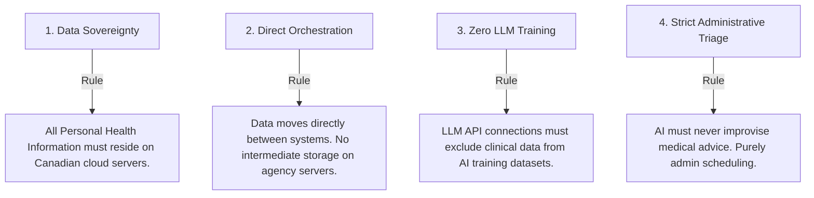

# PHIPA & PIPEDA Compliance for AI in Canadian Clinics: The Definitive Guide

**Target Keyword:** `PIPEDA compliant AI tools Canada` / `PHIPA compliant medical intake`  
**Secondary Keywords:** `healthcare AI compliance Canada`, `Jane App PHIPA compliance`, `EMR integration privacy standards`, `medical practice automation security`  
**Target URL:** `https://theskillcorner.com/blog/phipa-pipeda-canadian-medical-clinics-compliance`  
**Buyer Journey Stage:** Awareness / Consideration (Trust Building)

---

AI automation holds massive promise for Canadian healthcare practices. From dental clinics in Etobicoke to multi-practitioner clinics in North York, automating clinical administrative workflows is the single fastest way to reclaim lost clinician time.

Imagine: new patient intake forms that populate themselves inside your EMR, no-show reminder sequences that automatically refill cancelled slots from a text waitlist, and after-hours call routing that handles scheduling without human intervention.

But for clinic owners, managing partners, and practice managers in Canada, the primary question is never just: *"Will this save time?"* 

It is: **"Is this PHIPA and PIPEDA compliant?"**

With thousands of white-label "AI agencies" pitching standard American setups, understanding the specific regulatory landscape of Canadian healthcare privacy is crucial. A mistake in data handling doesn't just mean a poor customer experience—it represents significant regulatory liability.

This guide outlines exactly how to evaluate AI tools and custom automation integrations for PIPEDA and PHIPA compliance in Canada.

---

## 1. PIPEDA vs. PHIPA: What’s the Difference?

When automating systems in Canada, you must satisfy both federal and provincial legislation:

1. **PIPEDA (Personal Information Protection and Electronic Documents Act):** The federal privacy law governing how private-sector organizations collect, use, and disclose personal information in the course of commercial activity across Canada.
2. **PHIPA (Personal Health Information Protection Act):** Ontario's provincial health-specific privacy law. PHIPA is a "substantially similar" provincial law, meaning it takes precedence over PIPEDA in Ontario regarding Personal Health Information (PHI). 

Under PHIPA, health information custodians (physicians, dentists, physiotherapists, optometrists, psychologists) are strictly liable for the security of health records, including any data transmitted to third-party software tools.

---

## 2. The Four Pillars of Compliant Clinical AI Automation

If you are implementing AI tools or integrating systems (such as linking booking apps to your EMR), your setup must adhere to these four fundamental data security principles:

### Pillar 1: Data Sovereignty (Canadian Data Residency)
Under PHIPA and provincial health guidelines, Personal Health Information (PHI) should remain within Canadian jurisdiction. 
* **The Risk:** Many American AI SaaS tools route and store transcripts, patient names, and intake forms on servers located in the United States.
* **The Compliant Setup:** Your automation integrations must be configured to process and store data on Canadian cloud servers (e.g., AWS Canada East or Microsoft Azure Canada regions).

### Pillar 2: Direct Orchestration (No Intermediate Databases)
The safest way to automate is to ensure that the agency building your systems **never hosts or stores your patient records.**
* **The Risk:** White-label agencies often set up custom databases (like Airtable or Firebase) on their own accounts to store patient details before pushing them to your EMR. This creates a massive secondary attack surface.
* **The Compliant Setup:** Integrations should use encrypted pipelines (using SSL/TLS) to orchestrate data **directly** between your secure front-end form (like Typeform or Jotform) and your compliant EMR (like Jane App, Dentrix, or ABELDent). Once the transmission is complete, the intermediate integration nodes must delete the cache.

### Pillar 3: EMR and LLM API isolation
When utilizing large language models (LLMs) like Claude or GPT to extract details from insurance cards or summarize intake PDFs, you must isolate the data.
* **The Risk:** Free consumer versions of ChatGPT or Claude use your input data to train their models, meaning patient charts could leak into public model responses.
* **The Compliant Setup:** Automations must connect via **developer APIs** under strict commercial terms. Enterprise API agreements explicitly state that input data is *never* saved or used for model training, and data is deleted from temporary logging within 30 days.

### Pillar 4: Administrative Triage (No Medical Improvisation)
AI receptionists and assistants must be strictly bound to administrative tasks.
* **The Risk:** Unrestricted AI conversational agents trying to answer a patient asking: *"My child has a rash; should I give them Benadryl?"*
* **The Compliant Setup:** The AI receptionist must follow strict systemic guards. It must identify itself as an assistant, handle only scheduling, hours, and intake, and strictly route any clinical or urgent inquiries to a human practitioner or emergency services protocol (e.g., directing them to call 911).

---

## 3. How We Secure Specific Clinical Workflows

Here is how The Skill Corner designs specific automations to ensure compliance:

### Workflow A: Pre-Visit Digital Intake & EMR Sync
* **The Automation:** A new patient receives a text link to complete their intake form. The system extracts their insurance card details and uploads the structured data directly into their EMR chart.
* **Security Controls:**
  * Forms are built on PHIPA-compliant databases with end-to-end encryption.
  * Claude API is invoked over a secure endpoint to perform OCR (Optical Character Recognition) on the insurance card.
  * The patient's data is immediately pushed to the EMR API and purged from the integration gateway within 60 seconds.

### Workflow B: The Booking & Reminder Waitlist Loop
* **The Automation:** A reminder sequence goes out. If a cancellation occurs, the waitlist is automatically notified via SMS.
* **Security Controls:**
  * Texts contain only administrative details (time, date, clinician category).
  * No diagnostic information or specific treatment details are transmitted via unencrypted SMS.
  * One-tap reschedule links lead to a secure patient portal.

---

## 4. Checklist for Practice Managers: Evaluating an AI Vendor

Before signing a contract with any automation provider, ask them these four questions:

1. **"Where is our patient data stored?"** *(Correct answer: "It is not stored by us. It moves directly via encrypted channels into your EMR, and any temporary transit logs are deleted.")*
2. **"Are the AI APIs configured to prevent training on our data?"** *(Correct answer: "Yes. We use enterprise API endpoints under commercial agreements that exclude all data from LLM training sets.")*
3. **"Do you sign a PHIPA-compliant Data Processing Agreement?"** *(Correct answer: "Yes. We sign non-disclosure agreements and custom data privacy agreements before looking at your system configurations.")*
4. **"How does the system handle emergencies?"** *(Correct answer: "The AI receptionist operates on strict deterministic rules. Anything resembling a medical emergency triggers an immediate notification to your front desk and instructions to contact 911.")*

---

### Secure Your Practice Systems Today
Compliance should not stand in the way of efficiency. By building direct, secure integrations inside your existing EMR, you can save hours of administrative grind while maintaining the highest privacy standards.

Contact The Skill Corner to schedule a **Free 30-Minute Practice Automation Audit**. We will walk you through your data flows, EMR integrations, and security controls in plain English before anything is built.

👉 [Schedule Your Practice Audit](https://theskillcorner.com/book)
